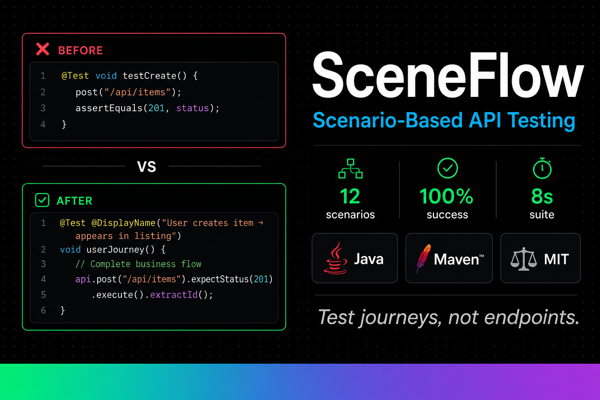

# SceneFlow

[](LICENSE)
[](https://openjdk.org/projects/jdk/21/)
[](https://maven.apache.org/)


**Test user journeys, not just endpoints**

> ✅ **Production Ready** - v1.0.1  
> 🎯 **12/12 tests passing** (100%)  
> ⚡ **8 seconds** for complete regression suite

---

## Qué es SceneFlow

Framework Java para testing de APIs basado en **escenarios de usuario reales**, no solo endpoints aislados.

**Problema**: Tests tradicionales validan responses individuales, no flujos de negocio.  
**Solución**: SceneFlow modela user journeys completos con contexto compartido y cleanup automático.

### Diferencia Clave

```java
// ❌ Traditional: Test isolated endpoint
@Test void testCreateNews() {
    Response response = post("/api/news", data);
    assertEquals(201, response.statusCode());
}

// ✅ SceneFlow: Test complete business flow
@Test void publishFeaturedNews_appearsOnHome() {
    String token = loginAsAdmin();
    Long newsId = api.post("/api/news").withAuth(token).execute().extractId();
    api.get("/api/news/featured").execute().assertArrayContains("id", newsId);
}
```

---

## Quick Start (5 minutos)

### Requirements

- Java 21+
- Maven 3.9+

### Run Your First Test

```bash
# Clone
git clone https://github.com/drhiidden/FSJ-Regressive.git
cd FSJ-Regressive

# Run tests
mvn test

# Ver reporte
open target/surefire-reports/index.html
```

---

## Características

- **Scenario-Based Testing**: Tests como user journeys completos
- **Fluent DSL**: API intuitiva `api.post(...).withAuth(token).execute()`
- **Automatic Cleanup**: Rollback automático de datos creados
- **Multi-Environment**: Dev, staging, prod configs
- **Async Support**: `waitUntil()`, `expectEventually()`
- **Performance Tracking**: Métricas de latencia por scenario
- **Regression Suite**: 12 tests, 100% passing, 8s execution

---

## Example Scenarios

```java
// CMS Workflow
@Test void publishNews_appearsInCategory() {
    String token = loginAsAdmin();
    Long newsId = createNews(token, "Breaking News", Category.GENERAL);
    assertNewsInCategory(Category.GENERAL, newsId);
}

// User Journey
@Test void userDiscoversArtist_exploresDiscography() {
    Long artistId = api.get("/api/artists").execute().extractFirstId();
    List<Long> albums = api.get("/api/artists/{id}/albums", artistId)
        .execute().extractIds();
    assertFalse(albums.isEmpty());
}

// Regression Check
@Test void backwardCompatibility_v1Endpoints() {
    api.get("/api/v1/legacy/artists").expectStatus(200).execute();
}
```

Ver más: **[docs/examples.md](docs/examples.md)**

---

## Stack

Java 21 · Maven · JUnit 5 · Rest-Assured · Lombok

---

## Documentación

- **[Architecture](docs/architecture.md)** - Cómo funciona + diagrama
- **[Examples](docs/examples.md)** - Escenarios detallados
- **[Comparison](docs/comparison.md)** - vs JUnit/TestNG/Rest-Assured
- **[CI/CD Integration](docs/ci-cd.md)** - GitHub Actions + GitLab CI
- **[AGENTS.md](AGENTS.md)** - Setup técnico paso a paso
- **[CHANGELOG.md](CHANGELOG.md)** - Historial de versiones

---

## Roadmap

- **v1.1** (2 months): GraphQL support, WebSocket testing
- **v1.2** (4 months): UI testing integration (Playwright), visual regression
- **v1.3** (6 months): SaaS dashboard, team collaboration

---

## Licencia

MIT - Ver [LICENSE](LICENSE)

---

**Metodología**: Desarrollado con [HCP (Human-Code-AI Protocol)](https://github.com/haletheia/human-code-ai-protocol)
